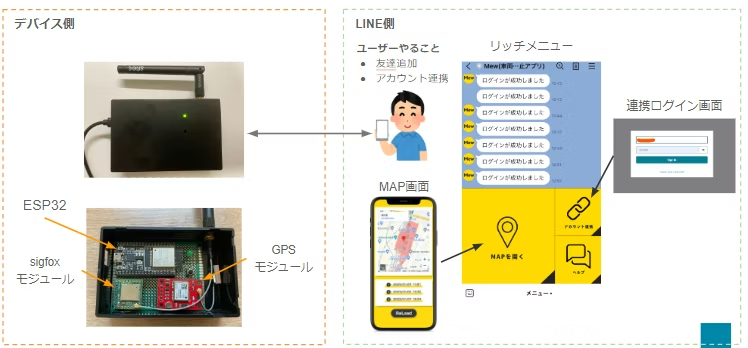
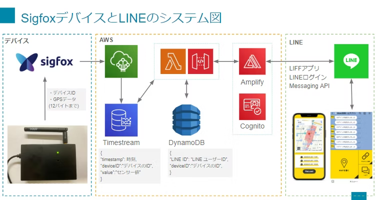

# SigfoxとLIFF(LINE)を利用した車両トラッキングデバイス構想(mew-project)
LINE Developers Communityで発表したプロダクトです。
https://linedevelopercommunity.connpass.com/event/275767/

## 詳細Qiita記事
詳細な背景はこちらを参照してください。
https://qiita.com/taiyyytai/items/c006b35cd2e23973c76c

### 概要

### アーキテクチャ

## 含まれるプロジェクト

| ディレクトリ | 内容 |
|--------------|------|
| `amplify-cognito-login-web` | **Amazon Cognito（Amplify Auth）** によるログイン画面のみの最小サンプル。 |
| `liff-account-link-web` | **LIFF** から連携用トークン取得 → **Cognito + アカウント連携** フロー。 |
| `liff-line-link-cognito-web` | LIFF + トークン検証 API + **Cognito 設定を環境変数で注入**する版。 |
| `liff-gps-map-web` | LIFF + バックエンドから GPS 履歴取得 + **Google Maps** 表示。 |
| `backend` | バックエンド（Lambda 群）。API Gateway 等のデプロイはこのリポジトリ外想定。 |

## backend（Lambda）の対応関係

`backend` には用途別に 3 本の Lambda があります（※ `mew-account-link` は未使用のため削除済み）。

| Lambda | 役割 | フロント側の呼び出し |
|---|---|---|
| `backend/mew-line-link` | LINE access token を検証し、`linkToken` を返す | `liff-account-link-web` の `REACT_APP_ACCOUNT_LINK_API` / `liff-line-link-cognito-web` の `REACT_APP_VALID_TOKEN_API` |
| `backend/mew-device-login-lambda` | Cognito の ID トークン（`Authorization`）から `nonce` を返す | `liff-account-link-web` の `REACT_APP_NONCE_API` / `liff-line-link-cognito-web` の `REACT_APP_ACCOUNT_LINK_API`（※nonce用途） |
| `backend/mew-location-recent` | LINE access token から紐付いた device を引き、直近 GPS を返す | `liff-gps-map-web` の `REACT_APP_MAP_API` |

### backend 側の環境変数（推奨）

- `LINE_CHANNEL_ACCESS_TOKEN`: LINE Messaging API のチャネルアクセストークン
- `LINE_CHANNEL_ID`: LINE チャネルID（access token 検証用）
- `ALLOWED_ORIGINS`: CORS 許可オリジン（CSV。例: `https://example.com,http://localhost:3000`）
- `AWS_REGION`: 例 `ap-northeast-1`（未指定なら実行環境の `AWS_REGION`）

## 推奨環境

- **Node.js 20.x**（ルートの `.nvmrc` 参照）
- パッケージマネージャはプロジェクトごとに **npm または yarn** が混在しています。各 README に従ってください。

## ライセンス

`LICENSE`（MIT）を参照してください。
